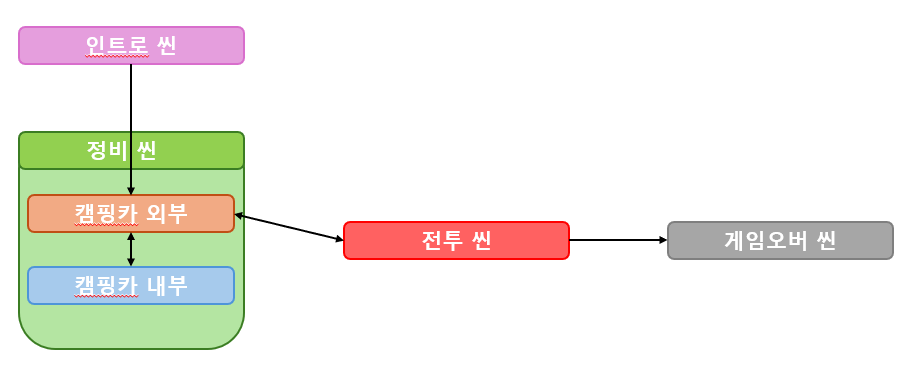

# 차박(Carsleeping) (C#, Unity)

---

**1인 개발 뱀서라이크 + 로그라이트 2D 런앤건 게임입니다.**

# 외부 링크

---

### 영상

[https://www.youtube.com/watch?v=yt2F3-Hdb5w](https://www.youtube.com/watch?v=yt2F3-Hdb5w)

### 코드

[https://github.com/cocoju1704/camping](https://github.com/cocoju1704/camping)

# 게임 소개

---

.gif)

**좀비 아포칼립스 세상에서 캠핑카를 타고다니며 점점 더 어려워지는 스테이지를 살아남자!**

- 뱀서라이크 + 로그라이트
- 플레이어는 스테이지에서 좀비를 사냥하거나, 상자를 부수어 여러 재료를 획득 가능
- 획득한 재료를 통해
    - 캠핑카 외부를 강화하거나(바퀴, 엔진, 범퍼 등)
    - 캠핑카 내부에 다양한 기능을 제공하는 시설을 설치하거나
    - 특정 가구를 제작하거나
    - 가구를 통해 아이템 및 스펙을 강화할 수 있음

# 게임 구조

---

## 전투 씬

### **경험치 획득 단계**
.gif)

적 처치 시 경험치를 획득합니다

### 차량 호출 단계
.gif)

플레이어는 몬스터를 처치해 일정 이상의 경험치를 획득하면 차량을 호출할 수 있게 됩니다.
.gif)

차량이 도착하면 플레이어는 차량 주변을 벗어나지 못하게 되며, 차량을 일정 시간동안 좀비들의 공격에서 지켜야 합니다.

차량 호출 후 도착까지 일정 시간 적의 공격을 버텨내야 합니다.

### **차량 탑승 단계**
.gif)

주어진 시간동안 차량을 지키는 데 성공하면, 스테이지가 클리어됩니다.

1. 스테이지 내 획득한 아이템은 인벤토리로 들어옵니다.
2. 차량의 체력 손실은 다음 스테이지에도 유지됩니다.

## 비전투 씬

### 캠핑카 내부

.gif)

플레이어는 캠핑카 내부 원하는 위치에 가구를 설치할 수 있습니다.

.gif)

가구는 종류에 따라 다양한 기능을 제공합니다.

미리보기를 통해 설치 가능 여부를 확인할 수 있습니다.

제작 테이블을 통해 상위 재료를 조합할 수 있습니다.

총기 제작 테이블을 통해 총기를 강화할 수 있습니다.

기타 가구들을 통해 플레이어 스펙을 강화할 수 있습니다.

### 캠핑카 외부

- 업그레이드를 통해 캠핑카의 스펙을 강화할 수 있습니다.

- 캠핑카: 스테이지에 등장하는 캠핑카의 기능 및 스펙을 강화합니다.
- 텐트: 게임을 저장합니다.

# 주요 설계

---

## 무한맵 구현

### 기능 및 의도

- 뱀서라이크 특유의 무한맵을 구현하기 위한 로직
- 총 4개의 TileMap을 플레이어의 이동 방향에 맞게 재배치하여 무한한 맵 상에 있는 느낌을 구현
- 플레이어로부터 멀리 떨어진 enemy를 재사용하고, bullet 등의 오브젝트는 비활성화하여 자원 사용을 최소화

### 구현

**전략 패턴**

- Reposition.cs: 무한맵을 위한 재배치 로직을 담당
- 해당 컴포넌트를 가지고 있는 오브젝트의 태그에 따라 다른 동작을 수행

## 오브젝트 풀링

### 의도

- Enemy, Loot, Block 등 반복되는 객체에 따른 생성/삭제를 최소화 하기 위해 오브젝트 풀 구현

### 구현

- PoolManager.cs에 반복적으로 생성/삭제되는 오브젝트의 프리팹 등록 및 오브젝트별 풀 관리
- 삭제 시: 해당 오브젝트를 풀에 유지한 채로 비활성화
- 생성 시: 풀에 비활성화된 오브젝트가 없을 시에만 인스턴스화 및 풀에 등록, 있을 시 해당 오브젝트 활성화 및 초기화

## 적 이동경로 계산

### 의도

- 지형지물(Block, Loot)등을 마주할 시 Enemy가 우회하는 로직

**시도 1: A* 알고리즘**

- 각 그리드를 노드로 하여 64 * 40개의 노드를 가진 그래프로 간주하여 A* 알고리즘 적용
- Enemy 오브젝트 수가 증가함에 따라 메모리 사용이 너무 커짐

**시도 2: Unity NavMesh 기능**

- 2D에 적용가능한 NavMeshPlus 플러그인 사용
- 재배치시, 그리고 실시간으로 블록이 파괴되는 게임 특성 상 미리 계산해두어야하는 Navmesh 적용이 힘듦

**차선책: 가벼운 알고리즘 + 장애물 파괴 공격 추가**

1. Raycast Detection으로 경로 상 장애물 탐지
2. 장애물 식별 시 플레이어 방향부터 45도를 더해가며 빈 방향 탐색
3. 가장 먼저 찾은 빈 방향으로 이동 후 탐색 재개
4. N초당 한 번씩 플레이어 방향으로 돌진 공격하며 경로 상 장애물 파괴

## 싱글톤 패턴

### 기능 및 의도

- 게임 부팅 시 생성되는 전역 매니저들(GameManager, DataManager…)은 모든 씬에서 접근이 가능하고, 하나의 인스턴스만 존재해야 하기 때문

### 구현

- Singleton.cs
    - 싱글톤 패턴을 보장하는 클래스
    - 해당 클래스를 상속한 오브젝트에 싱글톤 속성 부여

## 투사체 시스템

### 의도

- 런앤건 특성 상 공통점/차이점이 명확한 다양한 투사체들이 등장해야 함 ⇒ **데코레이터 패턴**
- 투사체에 회전, 추적, 폭발 등 다양한 속성을 모듈화하여 각 속성의 독립성, 유연성 보장
- 기본 클래스(Bullet.cs) + 여러 개의 데코레이터(BulletAddon.cs)

## 적 오브젝트 구현

### 의도

- 다양한 행동패턴과 스킬을 가진 적을 다양하게 구현해야 하기 때문에 편집의 용이를 위해 ScriptableObject를 사용하였다.

## 옵저버 패턴

### 기능 및 의도

- 발판은 모두 “플레이어가 접촉 시” 라는 동일한 작동 조건과 각기 다른 동작을 수행
- 동작에 참여하는 오브젝트는 씬 내 다양하게 위치
- 따라서, 발판이 **이벤트만 발생**시키고, 각 발판에 따른 구체적인 동작은 이들을 구독중인 매니저(ExteriorManager.cs)**에서 일괄적으로 처리

## 데이터 관리

### 의도

- 오브젝트의 저장/불러오기의 관리

ISavable: Save(), Load()가 정의된 인터페이스

- 저장 시 씬 내 모든 오브젝트 중 ISavable 인터페이스 속성을 가진 오브젝트를 순회하며 이를 .json형태로 세이브파일에 저장
- 불러오기: ISavable 인터페이스를 가진 오브젝트를 Awake() 시 불러오기

# 시스템

---

## 등장 엔티티

### 좀비

- 플레이어 또는 캠핑카를 공격하며, 처치 시 일정 확률로 특정 재료를 드랍

### 장애물

- 플레이어 혹은 좀비의 공격에 파괴되는 오브젝트.
- 랜덤하게 생성되며 플레이어는 이를 엄폐물로 활용할 수 있음

### 자원

- 파괴 시 재료를 드랍

### 재료

- 조합하여 상위 재료를 만들거나, 소모하여 가구, 무기, 캠핑카 등 업그레이드

## 조작

### 근접 공격

- 플레이어가 직접 방향을 조작
- 블록을 부술 수 있음
- 자원을 부술 수 있음
- 적의 투사체 공격을 지울 수 있음

### 원거리 공격

- 플레이어가 직접 방향을 조작
- 블록을 부술 수 있음.

### 특수 능력

- 캠핑카 내부에 특정 시설을 설치 시, 전투 중 사용 가능
- ex) 드론 시스템 설치 ⇒ 자원 채취 드론(사용 시 플레이어 인근 재료 습득) 사용 가능
- 여러 시설이 있어도 한 종류만 선택 가능

### 시설

- 재료를 소모해 캠핑카 내부에 여러 시설 설치가 가능
- 제작대 등 특정 시설에서 새로운 아이템 제작 가능
- 사격장 등 특정 시설에서 플레이어를 강화 가능

[배경설정](https://www.notion.so/1a0a03cecd12803382dfee27d326830c?pvs=21)
